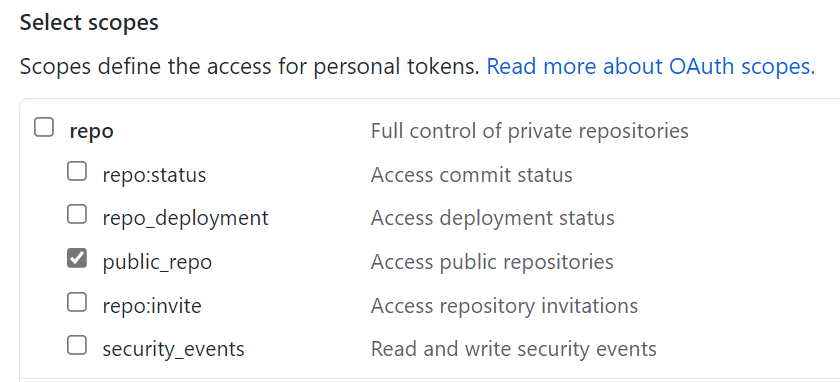

# Welcome to the Windows Package Manager Manifest Creator repository.

This repository contains the source code for the Windows Package Manager Manifest Creator.  The  Windows Package Manager Manifest Creator is designed to help generate or update manifest files for the [Community repo](https://github.com/microsoft/winget-pkgs).

## Overview

**Windows Package Manager Manifest Creator** is an Open Source tool designed to help developers create, update, and submit manifest files to the [Windows Package Manager repository](https://github.com/microsoft/winget-pkgs).

Developers will use this tool to submit their applications for use with the [Windows Package Manager](https://docs.microsoft.com/windows/package-manager/).

## Getting Started

For your convenience, **WingetCreate** can be acquired a number of ways.

### Install from the github repo

The **Windows Package Manager Manifest Creator** is available for download from the [winget-create](https://github.com/microsoft/winget-create/releases) repository.  To install the package, simply click the the MSIX file in your browser.  Once it has downloaded, click open.

### Install with Windows Package Manager

```powershell
winget install wingetcreate
```

### Install with [Scoop](https://scoop.sh/)

```powershell
scoop install wingetcreate
```

## Using Windows Package Manager Manifest Creator

**WingetCreate** has the following commands:

| Command  | Description |
| -------  | ----------- |
| [New](doc/new.md)      | Command for creating a new manifest from scratch |
| [Update](doc/update.md)  | Command for updating an existing manifest |
| [Submit](doc/submit.md)  | Command for submitting an existing PR  |
| [Token](doc/token.md)   | Command for managing cached GitHub personal access tokens |
| [Settings](doc/settings.md) | Command for editing the settings file configurations |
| [Cache](doc/cache.md) | Command for managing downloaded installers stored in cache
| [-?](doc/help.md)      | Displays command line help |

Click on the individual commands to learn more.

## Using Windows Package Manager Manifest Creator in a CI/CD pipeline

You can use WingetCreate to update your existing app manifest as part of your CI/CD pipeline. For reference, see the final task in this repo's [release Azure pipeline](https://github.com/microsoft/winget-create/blob/main/pipelines/azure-pipelines.release.yml).

### Using the standalone exe:

The latest version of the standalone exe can be found at https://aka.ms/wingetcreate/latest, and the latest preview version can be found at https://aka.ms/wingetcreate/preview, both of these require [.NET Runtime 6.0](https://dotnet.microsoft.com/en-us/download/dotnet/6.0) to be installed on the build machine. To install this on your build machine in your pipeline, you can include the following dotnet task:

```yaml
      - task: UseDotNet@2
        displayName: 'Install .NET Runtime'
        inputs:
          packageType: sdk
          version: '6.x'
          installationPath: '$(ProgramFiles)\dotnet'
```

Or you can utilize a PowerShell task and run the following script.

```PowerShell
    Invoke-WebRequest https://dot.net/v1/dotnet-install.ps1 -OutFile dotnet-install.ps1
    .\dotnet-install.ps1 -Runtime dotnet -Architecture x64 -Version 6.0.13 -InstallDir $env:ProgramFiles\dotnet
```

> **Note**: Make sure your build machine has the [Microsoft Visual C++ Redistributable for Visual Studio](https://support.microsoft.com/en-us/topic/the-latest-supported-visual-c-downloads-2647da03-1eea-4433-9aff-95f26a218cc0) already installed. Without this, the standalone WingetCreate exe will fail to execute and likely show a "DllNotFoundException" error.

To execute the standalone exe, add another PowerShell task to download and run the ./wingetcreate.exe to update your existing manifest. You will need a GitHub personal access token if you would like to submit your updated manifest. It is not recommended to hardcode your PAT in your script as this poses as a security threat. You should instead store your PAT as a [secret pipeline variable](https://docs.microsoft.com/azure/devops/pipelines/process/variables?view=azure-devops&tabs=yaml%2Cbatch#secret-variables).

```PowerShell
    Invoke-WebRequest https://aka.ms/wingetcreate/latest -OutFile wingetcreate.exe
    .\wingetcreate.exe update <packageId> -u $(packageUrls) -v $(manifestVersion) -t $(GITHUB_PAT)
```

### Using the msixbundle:

Windows Server 2022 now supports App Execution Aliases, which means the alias `wingetcreate` can be used to run the tool after installing the msixbundle. The latest version of the msixbundle can be found at https://aka.ms/wingetcreate/latest/msixbundle. Similar to the standalone exe steps, download the msixbundle, add the package, and run `wingetcreate` to update your manifest.

> **Note**: Winget-Create has a dependency on the [C++ Runtime Desktop framework package](https://docs.microsoft.com/en-us/troubleshoot/developer/visualstudio/cpp/libraries/c-runtime-packages-desktop-bridge). Be sure to also download and install this package prior to installing wingetcreate as shown in the steps below.

```yaml
- powershell: |
        # Download and install C++ Runtime framework package.
        iwr https://aka.ms/Microsoft.VCLibs.x64.14.00.Desktop.appx -OutFile $(vcLibsBundleFile)
        Add-AppxPackage $(vcLibsBundleFile)

        # Download Winget-Create msixbundle, install, and execute update.
        iwr https://aka.ms/wingetcreate/latest/msixbundle -OutFile $(appxBundleFile)
        Add-AppxPackage $(appxBundleFile)
        wingetcreate update Microsoft.WingetCreate -u $(packageUrl) -v $(manifestVersion) -t $(GITHUB_PAT) --submit
```

The CLI also supports creating or updating manifests with multiple installer URLs. You can either create new manifests with multiple installer nodes using the [New Command](doc/new.md) or update existing manifests with multiple installer URLs using the [Update Command](doc/update.md).

## GitHub Personal Access Token Permissions

When [creating your own GitHub Personal Access Token (PAT)](https://docs.github.com/en/github/authenticating-to-github/keeping-your-account-and-data-secure/creating-a-personal-access-token) to be used with WingetCreate, make sure the following permissions are selected.

- Select the **public_repo** scope to allow access to public repositories



- (Optional) Select the **delete_repo** scope permission if you want WingetCreate to automatically delete the forked repo that it created if the PR submission fails.

## Building the client

### Prerequisites

* Windows 10 1709 (16299) or later
* [Visual Studio 2022](https://visualstudio.microsoft.com/downloads/)
   * Or use winget to install it ;) (although you may need to adjust the workloads via Tools->Get Tools and Features...)
* [Git Large File Storage (LFS)](https://git-lfs.github.com/)
* The following workloads:
   * .NET Desktop Development
   * Universal Windows Platform Development

### Building

Open `winget-create\src\WingetCreateCLI.sln` in Visual Studio and build. We currently only build using the solution; command line methods of building a VS solution should work as well.

## Testing the client

### Running Unit and E2E Tests

Running unit and E2E tests are a great way to ensure that functionality is preserved across major changes. You can run these tests in Visual Studio Test Explorer.

### Testing Prerequisites

* Fork the [winget-pkgs-submission-test repository](https://github.com/microsoft/winget-pkgs-submission-test)
* Fill out the test parameters in the `WingetCreateTests/Test.runsettings` file
    *  `WingetPkgsTestRepoOwner`: The repository owner of the winget-pkgs-submission-test repo. (Repo owner must be forked from main "winget-pkgs-submission-test" repo)
    *  `WingetPkgsTestRepo`: The winget-pkgs test repository. (winget-pkgs-submission-test)
    *  `GitHubApiKey`: GitHub personal access token for testing.
       *  Instructions on [how to generate your own GitHubApiKey](https://docs.github.com/en/github/authenticating-to-github/creating-a-personal-access-token).
       *  Direct link to GitHub [Personal Access Tokens page](https://github.com/settings/tokens).
   * `GitHubAppPrivateKey`: Leave blank, this is only used by the build server.

* Set the solution wide runsettings file for the tests
    * Go to `Test` menu > `Configure Run Settings` -> `Select Solution Wide runsettings File` -> Choose your configured runsettings file

> **Warning**: You should treat your access token like a password. To avoid exposing your PAT, be sure to reset changes to the `WingetCreateTests/Test.runsettings` file before committing your changes. You can also use the command `git update-index --skip-worktree src/WingetCreateTests/WingetCreateTests/Test.runsettings` command to untrack changes to the file and prevent it from being committed.

## Contributing

This project welcomes contributions and suggestions.  Most contributions require you to agree to a
Contributor License Agreement (CLA) declaring that you have the right to, and actually do, grant us
the rights to use your contribution. For details, visit https://cla.opensource.microsoft.com. More
information is available in our [CONTRIBUTING.md](/CONTRIBUTING.md) file.

When you submit a pull request, a CLA bot will automatically determine whether you need to provide
a CLA and decorate the PR appropriately (e.g., status check, comment). Simply follow the instructions
provided by the bot. You will only need to do this once across all repos using our CLA.

This project has adopted the [Microsoft Open Source Code of Conduct](https://opensource.microsoft.com/codeofconduct/).
For more information, please refer to the [Code of Conduct FAQ](https://opensource.microsoft.com/codeofconduct/faq/) or
contact [opencode@microsoft.com](mailto:opencode@microsoft.com) with any additional questions or comments.

## Data/Telemetry

The wingetcreate.exe client is instrumented to collect usage and diagnostic (error) data and sends it to Microsoft to help improve the product.

If you build the client yourself the instrumentation will not be enabled and no data will be sent to Microsoft.

The wingetcreate.exe client respects machine wide privacy settings and users can opt-out on their device, as documented in the Microsoft Windows privacy statement [here](https://support.microsoft.com/help/4468236/diagnostics-feedback-and-privacy-in-windows-10-microsoft-privacy).

In short to opt-out, do one of the following:

**Windows 11**: Go to `Start`, then select `Settings` > `Privacy & security` > `Diagnostics & feedback` > `Diagnostic data` and unselect `Send optional diagnostic data`.

**Windows 10**: Go to `Start`, then select `Settings` > `Privacy` > `Diagnostics & feedback`, and select `Required diagnostic data`.

You can also opt-out of telemetry by configuring the `settings.json` file and setting the `telemetry.disabled` field to true. More information can be found in our [Settings Command documentation](/doc/settings.md)

See the [privacy statement](/PRIVACY.md) for more details.

## Known Issues
