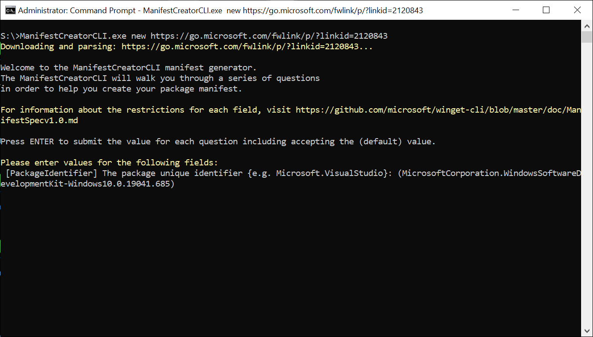
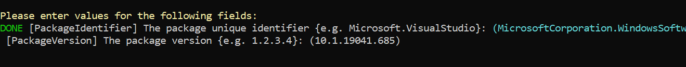
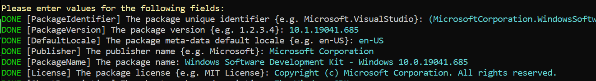
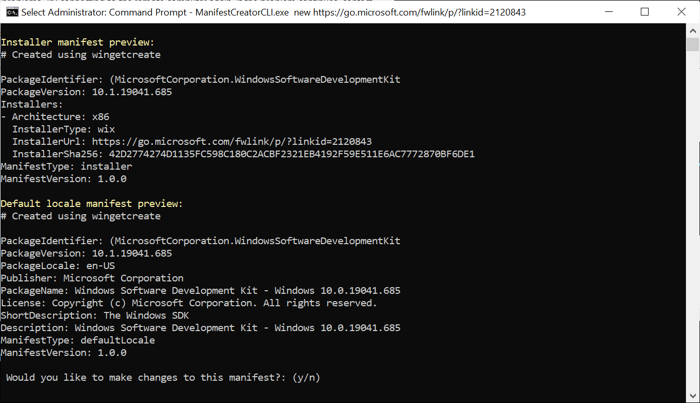

 # new command (Winget-Create)
 
The **new** command of the [Winget-Create](../README.md) tool begins the process of generating a manifest file.  This command is used if you need to create a [manifest file](https://docs.microsoft.com/windows/package-manager/package/manifest) for submitting software to the **Microsoft Community Package Manifest Repository** on GitHub.  

## Usage

`wingetcreate.exe new [<urls>] [\<options>]`

The **new** command can be called with the optional URL(s). **Winget-Create** will download each provided installer as it begins.  If the URL is not included, the user will need to add it when prompted. 

### Multiple URLs in command line:

When including multiple urls in the command line arguments, use a space to separate each installer you wish to include in your generated manifest.

`wingetcreate.exe new https://microsoft.com/foo.exe https://microsoft.com/bar.msix`

### Multiple URLs prompt:

If you choose not to include URLs in the command line, you will be prompted for your URLs. When prompted, use a comma to separate each installer url you wish to include in your generated manifest.

`[InstallerUrl] The installer URL(s): https://microsoft.com/foo.exe, https://microsoft.com/bar.msix`

## Arguments

The following arguments are available:

| Argument  | Description |
|--------------|-------------|
| **-o,--out** |  The output directory where the newly created manifests will be saved locally |
| **-t,--token**  | GitHub personal access token used for direct submission to the Windows Package Manager repo |
| **-?, --help** |  Gets additional help on this command |

## Winget-Create New Command flow

### Downloading the installer  

The first action **Winget-Create** will take is to download the installer. **Winget-Create** will attempt to access the meta data associated with the installer.  If the metadata is discovered, it will pre-populate the default strings.  
As can be seen in this image, the Windows SDK was used as the URL and the PackageIdentifier is pre-populated.

You can now accept the **PackageIdentifier** as it is, or you can choose to edit it by using the **DEL** and **ARROW** keys.

By typing **ENTER** you will accept the string, and the wizard will move on.

### Remaining required fields  

Like the **PackageIdentifier** you will have the opportunity to accept or modify the remaining fields.

### Review Changes
Once you have successfully filled in the details, fields, **Winget-Create** will display the results for you to review.  

If you would like to make changes, **Winget-Create** will walk you through the fields again allowing you to change them.  

If you are content with the changes, choose **no** and the manifest will be saved.

### Submit  

The last option **Winget-Create** will offer is for you to submit the manifest to the [Windows Package Manager repository](https://github.com/microsoft/winget-pkgs).  
If you choose yes, you will automatically submit your Pull Request (PR) to the [Windows Package Manager repository](https://github.com/microsoft/winget-pkgs).

> [!NOTE]  
If you have not logged on to GitHub, you will be taken to the GitHub authentication web page before allowing you to submit your manifest.  

