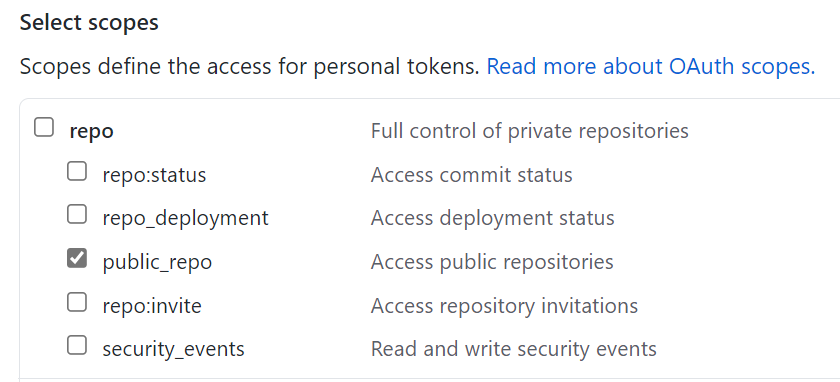

# token command (Winget-Create)

The **token** command of the [Winget-Create](../README.md) tool is designed to manage cached GitHub personal access tokens used by the tool for interacting with the [Windows Package Manager repo](https://docs.microsoft.com/windows/package-manager/) automatically.
To use the **token** command, you can specify whether you want to store a new [GitHub token](https://docs.github.com/en/github/authenticating-to-github/creating-a-personal-access-token) or clear any existing cached tokens. If you choose not to provide a token when storing, the tool will initiate an OAuth flow and prompt for your GitHub login credentials.

## GitHub Personal Access Token (classic) Permissions

When [creating your own GitHub Personal Access Token (PAT)](https://docs.github.com/en/github/authenticating-to-github/keeping-your-account-and-data-secure/creating-a-personal-access-token) to be used with WingetCreate, make sure the following permissions are selected.

- Select "Tokens (classic)". Fine-grained tokens are not supported (https://github.com/microsoft/winget-create/issues/595)
- Select the **public_repo** scope to allow access to public repositories

- (Optional) Select the **delete_repo** scope permission if you want WingetCreate to automatically delete the forked repo that it created if the PR submission fails.

## Usage

> [!WARNING] 
> Using the `--token` argument may result in the token being logged.  
> 
> For local development, it is recommended to go through the OAuth flow by omitting the `--token` argument.  
>   
> For CI/CD scenarios, it is recommended to use the 'WINGET_CREATE_GITHUB_TOKEN' environment variable to store the token.

`wingetcreate.exe token [\<options>]`

### Store a new GitHub token in your local cache

`wingetcreate.exe token --store --token <GitHubPersonalAccessToken>`

### Clear the cached GitHub token

`wingetcreate.exe token --clear`

## Arguments

The following arguments are available:

| 
Argument
| Description |
|----------------  |-------------|
| **-c, --clear**  | Required. Clear the cached GitHub token
| **-s, --store**  | Required. Set the cached GitHub token. Can specify token to cache with --token parameter, otherwise will initiate OAuth flow.
| **-t, --token**   | GitHub personal access token used for direct submission to the Windows Package Manager repo. If no token is provided, tool will prompt for GitHub login credentials.  ⚠️ _Using this argument may result in the token being logged. Consider an alternative approach https://aka.ms/winget-create-token._
| **-?, --help** |  Gets additional help on this command. |
